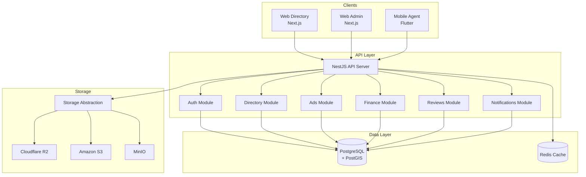
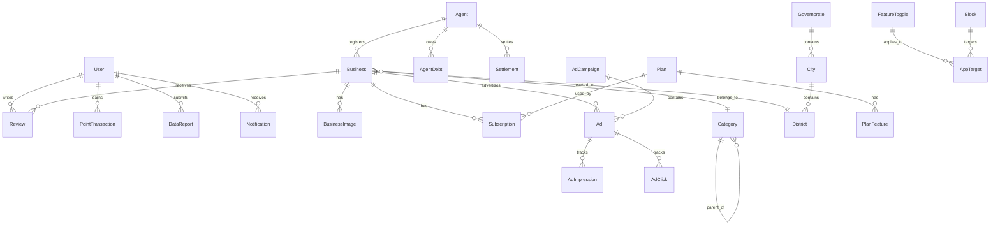

# Design Document: Green Pages (الصفحات الخضراء)

## Overview

Green Pages هو نظام دليل تجاري جغرافي متكامل يتبع نهج Modular Monolith. يتكون من API موحد (NestJS)، لوحة إدارة (Next.js)، واجهة دليل عامة (Next.js)، وتطبيق مندوب (Flutter). النظام يركز على البيانات الجغرافية، الأداء العالي، SEO المتقدم، ومرونة التحكم عبر Feature Toggles.

### Technology Stack
- **Backend**: NestJS + PostgreSQL + PostGIS + Prisma + Redis
- **Frontend**: Next.js 14+ (App Router) + Tailwind CSS + Leaflet
- **Mobile**: Flutter
- **Infrastructure**: VPS + Coolify + Docker

### Architecture Principles
1. **Modular Monolith**: وحدات منفصلة منطقياً داخل تطبيق واحد
2. **Geo-First**: كل كيان مرتبط بموقع جغرافي
3. **Feature Toggles**: كل ميزة قابلة للتفعيل/التعطيل
4. **Multi-tenant Storage**: دعم مزودات تخزين متعددة
5. **i18n-Ready**: دعم كامل للغات المتعددة

## Architecture

### System Architecture Diagram



### Module Structure

```
packages/
├── api/                    # NestJS Backend
│   └── src/
│       ├── modules/
│       │   ├── auth/       # Authentication & RBAC
│       │   ├── users/      # User management
│       │   ├── geo/        # Geographic data
│       │   ├── directory/  # Businesses & Categories
│       │   ├── plans/      # Subscription plans
│       │   ├── ads/        # Advertising system
│       │   ├── finance/    # Debts & Settlements
│       │   ├── reviews/    # Reviews & Ratings
│       │   ├── rewards/    # Points & Gamification
│       │   ├── reports/    # Data reports
│       │   ├── notifications/
│       │   ├── storage/    # File storage abstraction
│       │   ├── settings/   # Feature toggles & Blocks
│       │   └── i18n/       # Translations
│       ├── common/         # Shared utilities
│       └── config/         # Configuration
├── prisma/                 # Database schema
├── web-admin/              # Admin dashboard
├── web-directory/          # Public directory
├── mobile-agent/           # Flutter app for agents
├── mobile-user/            # Flutter app for users (main public app)
└── shared/                 # Shared types & contracts
```

## Components and Interfaces

### API Modules

#### Auth Module
```typescript
interface AuthService {
  login(credentials: LoginDto): Promise<TokenPair>;
  refresh(refreshToken: string): Promise<TokenPair>;
  logout(userId: string): Promise<void>;
  validateToken(token: string): Promise<UserPayload>;
}

interface TokenPair {
  accessToken: string;
  refreshToken: string;
  expiresIn: number;
}

enum UserRole {
  ADMIN = 'ADMIN',
  AGENT = 'AGENT',
  USER = 'USER'
}
```

#### Directory Module
```typescript
interface BusinessService {
  create(data: CreateBusinessDto, agentId?: string): Promise<Business>;
  update(id: string, data: UpdateBusinessDto): Promise<Business>;
  findById(id: string, locale: string): Promise<BusinessDetail>;
  search(query: SearchBusinessDto): Promise<PaginatedResult<BusinessCard>>;
  softDelete(id: string): Promise<void>;
}

interface SearchBusinessDto {
  query?: string;
  categoryId?: string;
  governorateId?: string;
  cityId?: string;
  districtId?: string;
  lat?: number;
  lng?: number;
  radius?: number;
  sortBy: 'nearest' | 'newest' | 'featured';
  page: number;
  limit: number;
  locale: string;
}
```

#### Geo Module
```typescript
interface GeoService {
  findNearestBusinesses(lat: number, lng: number, radius: number): Promise<Business[]>;
  findWithinBoundingBox(bounds: BoundingBox): Promise<Business[]>;
  getHierarchy(locale: string): Promise<GeoTree>;
  validateCoordinates(lat: number, lng: number): boolean;
}

interface BoundingBox {
  north: number;
  south: number;
  east: number;
  west: number;
}
```

#### Plans Module
```typescript
interface PlanService {
  create(data: CreatePlanDto): Promise<Plan>;
  getActivePlans(locale: string): Promise<Plan[]>;
  subscribe(businessId: string, planId: string, agentId?: string): Promise<Subscription>;
  checkExpiredSubscriptions(): Promise<void>; // Cron job
  getDefaultPlan(): Promise<Plan>;
}

interface PlanFeature {
  key: string;           // e.g., 'max_images', 'show_whatsapp'
  value: string | number | boolean;
}
```

#### Ads Module
```typescript
interface AdService {
  createCampaign(data: CreateCampaignDto): Promise<AdCampaign>;
  getAdsForPlacement(placement: AdPlacement, context: AdContext): Promise<Ad[]>;
  recordImpression(adId: string): Promise<void>;
  recordClick(adId: string): Promise<void>;
  getPerformanceReport(campaignId: string): Promise<AdReport>;
}

enum AdPlacement {
  SEARCH_SPONSORED = 'search_sponsored',
  HOME_HERO = 'home_hero',
  CATEGORY_BANNER = 'category_banner',
  PROFILE_SIDEBAR = 'profile_sidebar',
  MAP_PIN_HIGHLIGHT = 'map_pin_highlight',
  SEARCH_AUTOCOMPLETE = 'search_autocomplete'
}

interface AdContext {
  governorateId?: string;
  cityId?: string;
  districtId?: string;
  categoryId?: string;
  deviceType: 'mobile' | 'tablet' | 'desktop';
}
```

#### Finance Module
```typescript
interface FinanceService {
  recordCollection(agentId: string, amount: number, businessId: string, type: CollectionType): Promise<AgentDebt>;
  processSettlement(agentId: string, amount: number, accountantId: string): Promise<Settlement>;
  getAgentDebt(agentId: string): Promise<DebtSummary>;
  getAgentLedger(agentId: string, dateRange: DateRange): Promise<LedgerEntry[]>;
}

enum CollectionType {
  SUBSCRIPTION = 'subscription',
  AD_PAYMENT = 'ad_payment'
}
```

#### Reviews Module
```typescript
interface ReviewService {
  create(data: CreateReviewDto, userId: string): Promise<Review>;
  getForBusiness(businessId: string, pagination: PaginationDto): Promise<PaginatedResult<Review>>;
  moderate(reviewId: string, action: 'approve' | 'reject', adminId: string): Promise<void>;
  calculateAverageRating(businessId: string): Promise<number>;
}
```

#### Rewards Module
```typescript
interface RewardsService {
  awardPoints(userId: string, action: RewardAction, metadata?: object): Promise<PointTransaction>;
  getBalance(userId: string): Promise<number>;
  getHistory(userId: string, pagination: PaginationDto): Promise<PaginatedResult<PointTransaction>>;
  getUserLevel(userId: string): Promise<UserLevel>;
}

enum RewardAction {
  SUBMIT_REVIEW = 'submit_review',
  REPORT_WRONG_PHONE = 'report_wrong_phone',
  REPORT_CLOSED_BUSINESS = 'report_closed_business',
  FIRST_REVIEW_OF_DAY = 'first_review_of_day',
  VERIFIED_REPORT = 'verified_report'
}
```

#### Storage Module
```typescript
interface StorageProvider {
  putObject(key: string, data: Buffer, contentType: string): Promise<StorageResult>;
  getSignedUrl(key: string, expiresIn: number): Promise<string>;
  deleteObject(key: string): Promise<void>;
  exists(key: string): Promise<boolean>;
}

interface StorageResult {
  provider: string;
  bucket: string;
  objectKey: string;
  size: number;
  checksum: string;
}
```

#### Settings Module
```typescript
interface SettingsService {
  getFeatureToggle(key: string): Promise<boolean>;
  setFeatureToggle(key: string, value: boolean): Promise<void>;
  getAllToggles(): Promise<FeatureToggle[]>;
  getBlock(type: BlockType, target: AppTarget): Promise<Block>;
  updateBlock(id: string, settings: object): Promise<Block>;
}

enum BlockType {
  HEADER = 'header',
  FOOTER = 'footer',
  HOME_HERO = 'home_hero'
}
```

#### i18n Module
```typescript
interface I18nService {
  translate(key: string, locale: string, params?: object): string;
  getTranslations(namespace: string, locale: string): Promise<Record<string, string>>;
  setTranslation(key: string, locale: string, value: string): Promise<void>;
  getSupportedLocales(): string[];
}
```

## Data Models

### Entity Relationship Diagram



### Core Entities

```prisma
// User & Auth
model User {
  id            String   @id @default(cuid())
  email         String   @unique
  phone         String?  @unique
  passwordHash  String
  role          UserRole @default(USER)
  locale        String   @default("ar")
  points        Int      @default(0)
  isActive      Boolean  @default(true)
  createdAt     DateTime @default(now())
  updatedAt     DateTime @updatedAt
  
  reviews       Review[]
  pointTransactions PointTransaction[]
  reports       DataReport[]
  notifications Notification[]
  ownedBusinesses Business[] @relation("BusinessOwner")
  
  @@map("users")
}

model Agent {
  id            String   @id @default(cuid())
  userId        String   @unique
  user          User     @relation(fields: [userId], references: [id])
  employeeCode  String   @unique
  isActive      Boolean  @default(true)
  createdAt     DateTime @default(now())
  
  businesses    Business[]
  debts         AgentDebt[]
  settlements   Settlement[]
  
  @@map("agents")
}

// Geographic
model Governorate {
  id            String   @id @default(cuid())
  slug          String   @unique
  lat           Float?
  lng           Float?
  isActive      Boolean  @default(true)
  
  translations  GovernorateTranslation[]
  cities        City[]
  
  @@map("governorates")
}

model City {
  id            String   @id @default(cuid())
  governorateId String
  governorate   Governorate @relation(fields: [governorateId], references: [id])
  slug          String   @unique
  lat           Float?
  lng           Float?
  isActive      Boolean  @default(true)
  
  translations  CityTranslation[]
  districts     District[]
  
  @@map("cities")
}

model District {
  id            String   @id @default(cuid())
  cityId        String
  city          City     @relation(fields: [cityId], references: [id])
  slug          String   @unique
  lat           Float?
  lng           Float?
  isActive      Boolean  @default(true)
  
  translations  DistrictTranslation[]
  businesses    Business[]
  
  @@map("districts")
}

// Directory
model Category {
  id            String   @id @default(cuid())
  parentId      String?
  parent        Category? @relation("CategoryHierarchy", fields: [parentId], references: [id])
  children      Category[] @relation("CategoryHierarchy")
  slug          String   @unique
  icon          String?
  sortOrder     Int      @default(0)
  isActive      Boolean  @default(true)
  
  translations  CategoryTranslation[]
  businesses    Business[]
  
  @@map("categories")
}

model Business {
  id            String   @id @default(cuid())
  slug          String   @unique
  categoryId    String
  category      Category @relation(fields: [categoryId], references: [id])
  districtId    String
  district      District @relation(fields: [districtId], references: [id])
  agentId       String?
  agent         Agent?   @relation(fields: [agentId], references: [id])
  ownerId       String?
  owner         User?    @relation("BusinessOwner", fields: [ownerId], references: [id])
  
  lat           Float
  lng           Float
  location      Unsupported("geography(Point, 4326)")
  
  phone         String?
  phone2        String?
  whatsapp      String?
  email         String?
  website       String?
  
  workingHours  Json?    // { "mon": { "open": "09:00", "close": "17:00" }, ... }
  
  avgRating     Float    @default(0)
  reviewCount   Int      @default(0)
  viewCount     Int      @default(0)
  
  isFeatured    Boolean  @default(false)
  isVerified    Boolean  @default(false)
  isActive      Boolean  @default(true)
  deletedAt     DateTime?
  
  metaTitle     String?
  metaDescription String?
  
  createdAt     DateTime @default(now())
  updatedAt     DateTime @updatedAt
  
  translations  BusinessTranslation[]
  images        BusinessImage[]
  reviews       Review[]
  subscriptions Subscription[]
  ads           Ad[]
  reports       DataReport[]
  
  @@index([location], type: Gist)
  @@index([categoryId])
  @@index([districtId])
  @@index([slug])
  @@map("businesses")
}

model BusinessImage {
  id            String   @id @default(cuid())
  businessId    String
  business      Business @relation(fields: [businessId], references: [id])
  
  storageProvider String
  bucket        String
  objectKey     String
  mimeType      String
  size          Int
  checksum      String
  
  sortOrder     Int      @default(0)
  isPrimary     Boolean  @default(false)
  
  createdAt     DateTime @default(now())
  
  @@map("business_images")
}

// Plans & Subscriptions
model Plan {
  id            String   @id @default(cuid())
  slug          String   @unique
  price         Decimal  @db.Decimal(10, 2)
  durationDays  Int
  isDefault     Boolean  @default(false)
  isActive      Boolean  @default(true)
  sortOrder     Int      @default(0)
  
  translations  PlanTranslation[]
  features      PlanFeature[]
  subscriptions Subscription[]
  
  @@map("plans")
}

model PlanFeature {
  id            String   @id @default(cuid())
  planId        String
  plan          Plan     @relation(fields: [planId], references: [id])
  featureKey    String   // e.g., 'max_images', 'show_whatsapp', 'search_priority'
  featureValue  String   // stored as string, parsed based on key type
  
  @@unique([planId, featureKey])
  @@map("plan_features")
}

model Subscription {
  id            String   @id @default(cuid())
  businessId    String
  business      Business @relation(fields: [businessId], references: [id])
  planId        String
  plan          Plan     @relation(fields: [planId], references: [id])
  
  startDate     DateTime
  endDate       DateTime
  isActive      Boolean  @default(true)
  
  createdAt     DateTime @default(now())
  
  @@index([businessId])
  @@index([endDate])
  @@map("subscriptions")
}

// Advertising
model AdCampaign {
  id            String   @id @default(cuid())
  businessId    String
  business      Business @relation(fields: [businessId], references: [id])
  
  budget        Decimal  @db.Decimal(10, 2)
  startDate     DateTime
  endDate       DateTime
  isActive      Boolean  @default(true)
  
  createdAt     DateTime @default(now())
  updatedAt     DateTime @updatedAt
  
  ads           Ad[]
  
  @@map("ad_campaigns")
}

model Ad {
  id            String   @id @default(cuid())
  campaignId    String
  campaign      AdCampaign @relation(fields: [campaignId], references: [id])
  
  placement     AdPlacement
  
  // Targeting
  governorateId String?
  cityId        String?
  districtId    String?
  categoryId    String?
  
  // Scheduling
  activeHoursStart Int?  // 0-23
  activeHoursEnd   Int?  // 0-23
  
  impressions   Int      @default(0)
  clicks        Int      @default(0)
  
  isActive      Boolean  @default(true)
  
  @@index([placement])
  @@index([governorateId])
  @@index([categoryId])
  @@map("ads")
}

// Finance
model AgentDebt {
  id            String   @id @default(cuid())
  agentId       String
  agent         Agent    @relation(fields: [agentId], references: [id])
  businessId    String
  business      Business @relation(fields: [businessId], references: [id])
  
  amount        Decimal  @db.Decimal(10, 2)
  type          CollectionType
  
  createdAt     DateTime @default(now())
  
  @@index([agentId])
  @@map("agent_debts")
}

model Settlement {
  id            String   @id @default(cuid())
  agentId       String
  agent         Agent    @relation(fields: [agentId], references: [id])
  accountantId  String
  
  amount        Decimal  @db.Decimal(10, 2)
  notes         String?
  
  createdAt     DateTime @default(now())
  
  @@index([agentId])
  @@map("settlements")
}

// Reviews
model Review {
  id            String   @id @default(cuid())
  businessId    String
  business      Business @relation(fields: [businessId], references: [id])
  userId        String
  user          User     @relation(fields: [userId], references: [id])
  
  rating        Int      // 1-5
  text          String?
  
  status        ReviewStatus @default(PENDING)
  moderatedBy   String?
  moderatedAt   DateTime?
  
  createdAt     DateTime @default(now())
  updatedAt     DateTime @updatedAt
  
  @@index([businessId])
  @@index([userId])
  @@map("reviews")
}

// Rewards
model PointTransaction {
  id            String   @id @default(cuid())
  userId        String
  user          User     @relation(fields: [userId], references: [id])
  
  action        RewardAction
  points        Int
  metadata      Json?
  
  createdAt     DateTime @default(now())
  
  @@index([userId])
  @@map("point_transactions")
}

// Reports
model DataReport {
  id            String   @id @default(cuid())
  businessId    String
  business      Business @relation(fields: [businessId], references: [id])
  reporterId    String
  reporter      User     @relation(fields: [reporterId], references: [id])
  
  type          ReportType
  description   String?
  
  status        ReportStatus @default(PENDING)
  resolvedBy    String?
  resolvedAt    DateTime?
  resolution    String?
  
  createdAt     DateTime @default(now())
  
  @@index([businessId])
  @@index([status])
  @@map("data_reports")
}

// Notifications
model Notification {
  id            String   @id @default(cuid())
  userId        String
  user          User     @relation(fields: [userId], references: [id])
  
  type          NotificationType
  title         String
  body          String
  data          Json?
  
  isRead        Boolean  @default(false)
  readAt        DateTime?
  
  createdAt     DateTime @default(now())
  
  @@index([userId])
  @@index([isRead])
  @@map("notifications")
}

// Settings
model FeatureToggle {
  id            String   @id @default(cuid())
  key           String   @unique
  value         Boolean  @default(false)
  description   String?
  target        AppTarget
  
  updatedAt     DateTime @updatedAt
  
  @@map("feature_toggles")
}

model Block {
  id            String   @id @default(cuid())
  type          BlockType
  target        AppTarget
  schemaVersion Int      @default(1)
  settingsJson  Json
  isEnabled     Boolean  @default(true)
  
  updatedAt     DateTime @updatedAt
  
  @@unique([type, target])
  @@map("blocks")
}

// Translations
model BusinessTranslation {
  id            String   @id @default(cuid())
  businessId    String
  business      Business @relation(fields: [businessId], references: [id])
  locale        String
  
  name          String
  description   String?
  address       String?
  
  @@unique([businessId, locale])
  @@map("business_translations")
}

model CategoryTranslation {
  id            String   @id @default(cuid())
  categoryId    String
  category      Category @relation(fields: [categoryId], references: [id])
  locale        String
  
  name          String
  description   String?
  
  @@unique([categoryId, locale])
  @@map("category_translations")
}

model PlanTranslation {
  id            String   @id @default(cuid())
  planId        String
  plan          Plan     @relation(fields: [planId], references: [id])
  locale        String
  
  name          String
  description   String?
  
  @@unique([planId, locale])
  @@map("plan_translations")
}

model GovernorateTranslation {
  id            String   @id @default(cuid())
  governorateId String
  governorate   Governorate @relation(fields: [governorateId], references: [id])
  locale        String
  
  name          String
  
  @@unique([governorateId, locale])
  @@map("governorate_translations")
}

model CityTranslation {
  id            String   @id @default(cuid())
  cityId        String
  city          City     @relation(fields: [cityId], references: [id])
  locale        String
  
  name          String
  
  @@unique([cityId, locale])
  @@map("city_translations")
}

model DistrictTranslation {
  id            String   @id @default(cuid())
  districtId    String
  district      District @relation(fields: [districtId], references: [id])
  locale        String
  
  name          String
  
  @@unique([districtId, locale])
  @@map("district_translations")
}

// Enums
enum UserRole {
  ADMIN
  AGENT
  USER
}

enum AdPlacement {
  SEARCH_SPONSORED
  HOME_HERO
  CATEGORY_BANNER
  PROFILE_SIDEBAR
  MAP_PIN_HIGHLIGHT
  SEARCH_AUTOCOMPLETE
}

enum CollectionType {
  SUBSCRIPTION
  AD_PAYMENT
}

enum ReviewStatus {
  PENDING
  APPROVED
  REJECTED
}

enum RewardAction {
  SUBMIT_REVIEW
  REPORT_WRONG_PHONE
  REPORT_CLOSED_BUSINESS
  FIRST_REVIEW_OF_DAY
  VERIFIED_REPORT
}

enum ReportType {
  WRONG_PHONE
  WRONG_LOCATION
  CLOSED_BUSINESS
  WRONG_INFO
  SPAM
}

enum ReportStatus {
  PENDING
  RESOLVED
  REJECTED
}

enum NotificationType {
  SUBSCRIPTION_EXPIRY
  REVIEW_REPLY
  REPORT_RESOLVED
  POINTS_EARNED
  SYSTEM
}

enum AppTarget {
  WEB_DIRECTORY
  WEB_ADMIN
  MOBILE_AGENT
  ALL
}

enum BlockType {
  HEADER
  FOOTER
  HOME_HERO
}
```


## Error Handling

### API Error Response Format

```typescript
interface ApiError {
  statusCode: number;
  errorCode: string;      // e.g., 'AUTH_001', 'BIZ_002'
  message: string;
  details?: object;
  timestamp: string;
  path: string;
}
```

### Error Codes by Module

| Module | Code Range | Example |
|--------|-----------|---------|
| Auth | AUTH_001-099 | AUTH_001: Invalid credentials |
| Directory | DIR_001-099 | DIR_001: Business not found |
| Geo | GEO_001-099 | GEO_001: Invalid coordinates |
| Plans | PLN_001-099 | PLN_001: Plan not found |
| Ads | ADS_001-099 | ADS_001: Campaign budget exceeded |
| Finance | FIN_001-099 | FIN_001: Insufficient debt balance |
| Reviews | REV_001-099 | REV_001: Duplicate review |
| Storage | STR_001-099 | STR_001: Upload failed |

### Validation Strategy

1. **DTO Level**: class-validator decorators for input validation
2. **Service Level**: Business logic validation
3. **Database Level**: Constraints and triggers

```typescript
// Example DTO validation
class CreateBusinessDto {
  @IsString()
  @MinLength(2)
  @MaxLength(200)
  name: string;

  @IsUUID()
  categoryId: string;

  @IsLatitude()
  lat: number;

  @IsLongitude()
  lng: number;

  @IsOptional()
  @IsPhoneNumber()
  phone?: string;
}
```

## Testing Strategy

### Testing Approach

النظام يستخدم نهجاً مزدوجاً للاختبار:
1. **Unit Tests**: للتحقق من أمثلة محددة وحالات حدية
2. **Property-Based Tests**: للتحقق من خصائص عامة عبر مدخلات متعددة

### Testing Framework

- **Backend**: Jest + fast-check (property-based testing)
- **Frontend**: Vitest + React Testing Library
- **E2E**: Playwright

### Test Configuration

```typescript
// Property tests configuration
const propertyTestConfig = {
  numRuns: 100,        // Minimum iterations per property
  seed: Date.now(),    // For reproducibility
  verbose: true
};
```


## Correctness Properties

*A property is a characteristic or behavior that should hold true across all valid executions of a system-essentially, a formal statement about what the system should do. Properties serve as the bridge between human-readable specifications and machine-verifiable correctness guarantees.*

### Property 1: Auth Token Validation
*For any* valid user credentials, the API_Server should return a valid JWT token pair, and for any invalid credentials, authentication should fail with appropriate error.
**Validates: Requirements 1.1**

### Property 2: Role-Based Access Control
*For any* user with a specific role (ADMIN, AGENT, USER), they should only be able to access endpoints permitted for that role, and requests to unauthorized endpoints should return 403 Forbidden.
**Validates: Requirements 1.2**

### Property 3: Audit Logging Completeness
*For any* admin action (create, update, delete on sensitive entities), an audit log entry should be created containing: action type, user ID, timestamp, and affected entity.
**Validates: Requirements 1.4**

### Property 4: Rate Limiting Enforcement
*For any* authentication endpoint, after exceeding the configured request limit within the time window, subsequent requests should be rejected with 429 Too Many Requests.
**Validates: Requirements 1.5**

### Property 5: Geographic Hierarchy Integrity
*For any* geographic entity (City, District), its parent reference must point to a valid existing parent entity, and the hierarchy must form a valid tree structure.
**Validates: Requirements 2.2**

### Property 6: Geo Query Correctness
*For any* geographic query (nearest within radius, bounding box), all returned businesses must satisfy the geographic constraint (within radius or within bounds).
**Validates: Requirements 2.3, 2.4**

### Property 7: Business Validation Completeness
*For any* business creation or update, if required fields (name, categoryId, lat, lng) are missing or invalid, the operation should fail with validation error.
**Validates: Requirements 3.1, 3.3**

### Property 8: Soft Delete Data Preservation
*For any* soft-deleted business, the record should still exist in database with deletedAt timestamp set, and should be excluded from public queries but accessible to admins.
**Validates: Requirements 3.4**

### Property 9: Category Name Uniqueness
*For any* two categories with the same parent, their names (within same locale) must be unique.
**Validates: Requirements 4.2**

### Property 10: Search Result Correctness
*For any* search query with filters, all returned businesses must match the search criteria (text match in searchable fields, within geographic filter, correctly sorted).
**Validates: Requirements 5.1, 5.2, 5.3, 5.4**

### Property 11: Subscription Date Calculation
*For any* new subscription, the endDate should equal startDate plus plan.durationDays.
**Validates: Requirements 6.2**

### Property 12: Expired Subscription Default Plan Assignment
*For any* business whose subscription has expired, querying their active plan should return the default (free) plan.
**Validates: Requirements 6.5**

### Property 13: Plan Feature Visibility Control
*For any* business with an active plan, only features enabled in that plan should be visible/accessible on their profile.
**Validates: Requirements 6.7**

### Property 14: Ad Targeting Accuracy
*For any* ad request with context (location, category), only ads whose targeting criteria match the context should be returned.
**Validates: Requirements 7.3**

### Property 15: Payment Creates Debt Record
*For any* cash payment recorded by an agent, an AgentDebt record should be created with the exact amount and correct business reference.
**Validates: Requirements 8.3, 9.1**

### Property 16: Settlement Reduces Debt
*For any* settlement processed, the agent's total debt should decrease by exactly the settlement amount.
**Validates: Requirements 9.2**

### Property 17: Non-Negative Debt Invariant
*For any* settlement operation, if the settlement amount exceeds current debt, the operation should fail (debt cannot go negative).
**Validates: Requirements 9.5**

### Property 18: Feature Toggle Immediate Effect
*For any* feature toggle change, subsequent API requests should immediately reflect the new toggle value without restart.
**Validates: Requirements 10.2**

### Property 19: Storage Round-Trip Consistency
*For any* file uploaded through the storage abstraction, downloading it should return identical content (checksum match).
**Validates: Requirements 12.1, 12.3**

### Property 20: Translation Fallback
*For any* translatable entity requested in a locale where translation is missing, the system should return the Arabic (primary) translation.
**Validates: Requirements 14.6**

### Property 21: Review Average Calculation
*For any* business with reviews, the avgRating should equal the arithmetic mean of all approved review ratings.
**Validates: Requirements 16.2**

### Property 22: Duplicate Review Prevention
*For any* user attempting to submit a second review for the same business within 30 days, the operation should fail.
**Validates: Requirements 16.6**

### Property 23: Points Award Correctness
*For any* reward action performed by a user, the correct number of points (as configured) should be added to their balance.
**Validates: Requirements 17.1**

